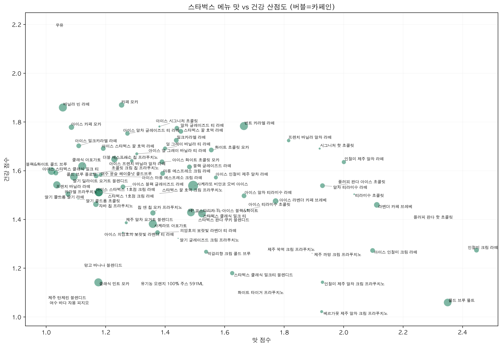
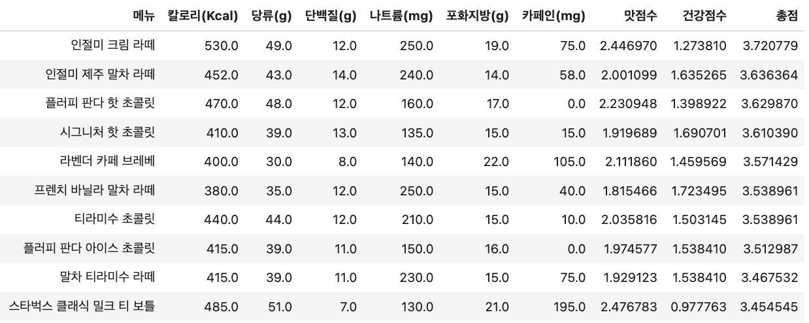

### 스타벅스 메뉴 영양 성분 분석 : 건강한데 맛있는 음료는?

#### 프로젝트 개요
기간 : 2025.10.01 ~ 2025.10.02   
주제 : 스타벅스 메뉴 영양 성분 분석 — “건강하면서도 맛있는 음료는 무엇일까?”   

#### 프로젝트 동기
스타벅스는 "나만의 음료 레시피" 서비스를 제공하며, 소비자가 취향에 맞는 음료를 직접 선택할 수 있도록 돕고 있다.   
이는 맛과 건강을 동시에 추구하는 현대인의 니즈를 반영한 기능이다. 그러나 이러한 서비스가 모든 소비자에게 직관적이고 용이한 것은 아니다.   
  
따라서 실제 메뉴별 영양성분 데이터를 수집·정리하여, 소비자 관점에서 어떤 음료가 건강에 유리하고 맛있는지 데이터로 보여주는 것을 목표로 했다.  

#### 프로젝트 목표
1. 스타벅스 메뉴 영양 데이터를 수집 후 정리한다.  
2. 메뉴 - 카테고리 - 영양 성분 간 관계를 분석한다.  
3. 맛(칼로리, 당류, 포화지방)과 건강(저칼로리, 저당류, 단백질) 간 균형을 시각화한다.  
4. 소비자 관점에서 카테고리별 특징과 메뉴별 Top/Low 랭킹을 제시한다.  

#### 데이터 수집 
출처 : 스타벅스 코리아 공식 홈페이지 영양정보 페이지  
방법 :  
개발자 도구를 활용하여 HTML 구조 확인  
<table> 태그에 정리된 영양 성분 정보를 pandas.read_html()로 추출  
카테고리별(콜드브루, 프라푸치노, 라떼, 티) 데이터를 병합  
최종 CSV(Starbucks_Menu_cat.csv)로 정리  

#### 데이터 전처리
object → float 숫자형 변환   
결측치 확인 (없음)  
카테고리 컬럼 생성  

#### 시각화 결과  
- 영양소 간 상관관계    
- 카테고리별 평균 비교  
- 영양소별 Top/Low 10  
- 맛 vs 건강 산점도  

#### 인사이트

1. 맛 vs 건강 관계
대부분의 메뉴는 맛 점수(1.0 - 2.0), 건강 점수(1.0 - 1.8)에 분포하며, 맛과 건강이 동시에 높은 메뉴는 드물다.  
프라푸치노·초콜릿 음료 : 맛은 강하지만 건강 점수 낮음 → 고칼로리·고당류   
티 계열 음료 : 건강 점수 높지만 맛 점수 낮음 → 저칼로리·저당류  
라떼 일부 메뉴 : 맛과 건강이 동시에 일정 수준 이상 확보된 균형형 메뉴 존재 

2. 건강 점수 Top 10 
저칼로리, 저당류, 단백질이 포함된 메뉴 위주  
아이스 티 라떼, 티 계열 음료가 다수 포함 → 건강 지향형 소비자에게 적합 

3. 맛 점수 Top 10 
프라푸치노, 크림, 초콜릿 음료가 대부분  
칼로리·당류·포화지방이 높아 풍미는 강하지만 건강 점수가 낮음  
디저트 대체재로는 매력적이나, 과다 섭취 시 부담 요인
 

4. 맛+건강 총점 Top 10    
라떼와 초콜릿 음료가 주로 포함   
인절미 라떼 시리즈, 플러피 판다 초콜릿이 상위권    
칼로리와 당류는 다소 높지만, 단백질 기여와 적정 카페인으로 맛과 건강의 균형 달성    
히트맵 분석 결과, 칼로리·단백질·나트륨·카페인 값이 적절히 분포하며 극단적이지 않음   
카테고리 분포 : 라떼·티 계열이 균형형 음료의 중심축을 담당

#### 프로젝트 마무리 및 한계

이번 프로젝트를 통해 **스타벅스 메뉴 영양 성분을 소비자 관점에서 해석**하며,  
“맛과 건강의 균형”이라는 주제를 데이터 기반으로 탐색할 수 있었다.  

그러나 다음과 같은 한계가 있었다.  

1. 정규화 방식
- Min-Max 정규화를 사용했는데, 특정 메뉴(예: 인절미 크림 라떼)가 과도하게 상위권에 올랐다.  
- ➡ Z-score 표준화, 다른 스케일링 방식 적용 필요  

2. 맛 점수 정의
- 칼로리·당류·포화지방을 단순 합산하였다.  
- ➡ 실제 ‘맛’에는 **향, 시즌성, 시각적 만족감 등 다양한 요인**이 작용  

3. 건강 점수 정의
- 저칼로리·저당류·단백질만 반영하였다.  
- ➡ 실제 건강에는 **카페인, 나트륨, 지방 종류 등 더 다양한 요인** 고려 필요

#### 최종 정리
이번 프로젝트는 데이터 수집 → 전처리 → 시각화 → 인사이트 도출 과정을 거쳐,
“스타벅스 메뉴에서 맛과 건강의 균형을 찾을 수 있는가?”라는 질문을 풀어냈다.
정규화, 점수 정의, 지표 해석에서 보완할 점이 있지만,
이를 개선한다면 실제 소비자 맞춤형 음료 추천 서비스로 발전시킬 수 있을 것이라 생각한다. 
